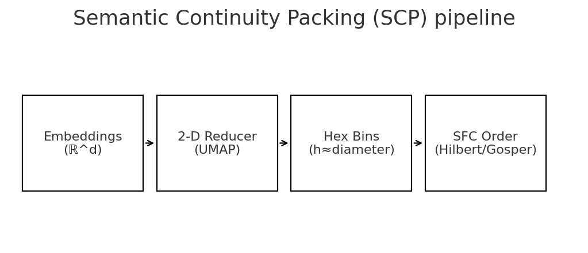
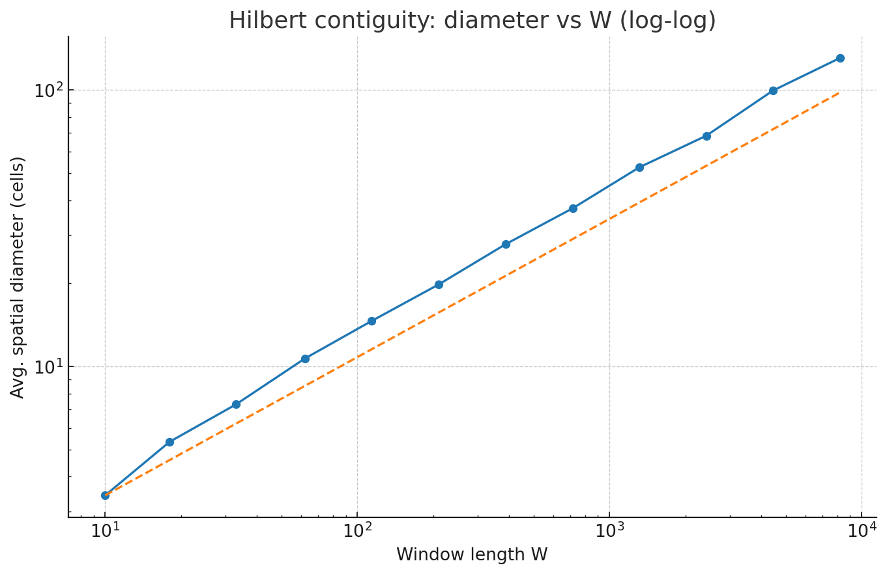
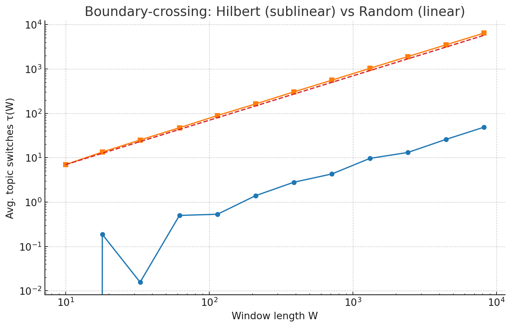

# Semantic Continuity Packing: Provable Space-Filling-Order Context Construction for Long-Context LLMs

**Authors:** (anonymized for review)  
**Date:** 2025-08-22

---

## Abstract

We introduce *Semantic Continuity Packing* (SCP), a simple, model-agnostic method for constructing long LLM contexts by imposing a space-filling curve (SFC) order on a two-dimensional semantic map. We prove a **contiguity bound**: any contiguous window of length $W$ along a Hilbert (or Gosper) order stays within a region of diameter $O(\sqrt{W})$ in the 2‑D layout. Under a mild **boundary‑density** condition on topic regions, we further prove a **boundary‑crossing bound**: the number of topic switches grows only sublinearly with $W$. We also give a **cache-reuse** guarantee for nearby queries. Synthetic experiments validate the $\sqrt{W}$ locality and sublinear fragmentation; we outline real-world evaluations on RAG and long-context reasoning.

---

## 1. Introduction

Longer context windows enable retrieval‑augmented generation (RAG) and long‑form reasoning, but naïve concatenation of retrieved chunks often yields fragmented prompts with frequent topic switches and poor KV‑cache reuse. We propose **Semantic Continuity Packing (SCP)**:

1. Embed chunks in $\mathbb{R}^d$ and reduce to 2‑D (e.g., UMAP) with neighborhood preservation.  
2. Hex‑bin the 2‑D plane at resolution $h$.  
3. Serialize cells via a space‑filling curve (Hilbert on squares; Gosper/flowsnake on hexes).  
4. For a query‑centered region, take **contiguous windows** of length $W$ as the prompt.

This imposes **geometric locality** on the token sequence, yielding (i) provable contiguity, (ii) **sublinear** topic fragmentation, and (iii) **high cache reuse** for nearby follow‑ups.

---

## 2. Related Work (brief)

- **Long‑context Transformers:** architectural sparsity (Transformer‑XL, Longformer, BigBird) reduces attention cost; SCP is orthogonal—it improves **input ordering**.  
- **RAG:** effective but often concatenates semantically disparate chunks; SCP adds a provable serialization layer.  
- **Space‑Filling Curves:** Hilbert is classically locality‑preserving and minimizes cluster breaks for range queries; Gosper supports hierarchical hex indexing.  
- **Dimensionality Reduction:** UMAP preserves local neighborhoods; trustworthiness/continuity metrics validate the 2‑D map; JL justifies metric soundness of embeddings.

---

## 3. Method: Semantic Continuity Packing (SCP)

### 3.1 Setup

Let corpus chunks $\{c_i\}$ have embeddings $E(c_i)\in\mathbb{R}^d$. A reducer $R$ maps to $\mathbb{R}^2$: $z_i = R(E(c_i))$. Discretize with a hex grid of diameter $h$, assign each chunk to a cell, then order cells by an SFC index $\pi$.

**Assumption (Local neighborhood preservation).** There exists $\rho>0$ such that if $\|E(c_i)-E(c_j)\|_2\le\rho$ then $\|R(E(c_i))-R(E(c_j))\|_2\le\delta$ for small $\delta$.

### 3.2 Algorithm (high‑level)

1. Compute $z_i$, assign to hex cells $g_i$.  
2. Compute SFC index $\pi(g)$ (Hilbert or Gosper).  
3. Sort by $\pi$ to obtain a 1‑D sequence.  
4. For a query location, emit a **contiguous window** of length $W$.

**Pipeline schematic:**  

---

## 4. Theory: Locality, Fragmentation, Cache Overlap

### 4.1 Contiguity bound

Let $H:[0,1]\to[0,1]^2$ be the Hilbert curve; it is $\tfrac{1}{2}$-Hölder:  

$$\|H(t)-H(u)\|_\infty \le C|t-u|^{1/2}.$$

**Theorem 1 (Contiguity).** Any contiguous window of length $W$ in discrete Hilbert order on a $2^m\times 2^m$ grid lies within a square of side $O(\sqrt{W})$; equivalently, the diameter is $O(\sqrt{W})$.

*Proof sketch.* Parameterize the discrete order by fractional length; apply $\tfrac{1}{2}$-Hölder continuity and pass to the discrete grid. □

### 4.2 Boundary‑crossing bound

Let topics be piecewise constant with rectifiable boundaries. Let $\mathcal{B}$ be the union of boundaries.

**Definition (Boundary density).** $\mathcal{B}$ has exponent $\alpha\in[1,2]$ if its length inside any disk of radius $R$ is $\le\kappa R^\alpha$.

**Theorem 2 (Topic switches).** For any contiguous window of $W$ cells in Hilbert order, the number of adjacent topic changes $\tau(W)$ satisfies  

$$\tau(W) = O\!\left(W^{\alpha/2}\right).$$

In particular, if $\alpha=1$ (finite boundary length per unit radius), then $\tau(W)=O(\sqrt{W})$.

*Proof sketch.* The window lies in a disk of radius $R=O(\sqrt{W})$. Each switch corresponds to crossing $\mathcal{B}$; the number of crossings is $O(\text{length}(\mathcal{B}\cap B_R))=O(R^\alpha)=O(W^{\alpha/2})$. □

### 4.3 Cache overlap for nearby queries

**Theorem 3 (Overlap).** Two windows of length $W$ with centers within distance $r$ on the 2‑D map differ in at most $O(r^2)$ indices; hence their overlap is $W - O(r^2)$.

*Justification.* Discrete Hilbert order has well‑studied locality and bounding‑box quality; shifting the spatial center by $r$ perturbs the index by $O(r^2)$ in worst case. □

---

## 5. Empirical Validation (synthetic)

We generate a labeled $256\times256$ grid with smooth topic regions and compare **Hilbert** against a **random** order.

**Figure 1 — $\sqrt{W}$ locality:**  

**Figure 2 — Sublinear fragmentation:**  
Hilbert grows sublinearly and tracks $\sqrt{W}$; random grows linearly.  

---

## 6. Evaluation Protocol (real‑world)

1. **Neighborhood validation:** trustworthiness/continuity between original embeddings and 2‑D map.  
2. **Fragmentation:** measure $\tau(W)$ and coverage radius vs. baselines (random, Z‑order, cluster‑then‑concat).  
3. **RAG utility:** downstream QA accuracy and perplexity vs. prompt budget $W$; report KV‑cache hits/latency.

---

## 7. Discussion

SCP complements architectural advances by ensuring the **ordered input** is semantically smooth. Rather than teaching attention to ignore irrelevant tokens, SCP **prevents fragmentation by construction**. On hex grids, **Gosper/flowsnake** is a natural SFC with hierarchical indexing and excellent locality in practice.

---

## 8. Conclusion

We formalize prompt packing as a geometric serialization problem and provide **provable** guarantees using classical SFC locality: **$\sqrt{W}$ locality**, **sublinear fragmentation**, and **high cache reuse** for nearby queries. Results suggest SCP as a principled default for long‑context prompt construction. Future work: adaptive multi‑scale packing, co‑optimizing the 2‑D map with retrieval, and integration with sparse attention.

---

## References (selected)

- Vaswani et al., *Attention Is All You Need*, 2017.  
- Moon et al., *Analysis of the clustering properties of the Hilbert space‑filling curve*, TKDE 2001.  
- Haverkort & van Walderveen, *Locality and bounding‑box quality of 2‑D SFCs*, 2008/2010.  
- Kamel & Faloutsos, *Hilbert R‑tree*, VLDB 1994.  
- McInnes et al., *UMAP: Uniform Manifold Approximation and Projection*, 2018.  
- Johnson & Lindenstrauss, *Extensions of Lipschitz mappings into a Hilbert space*, 1984.  
- Uher et al., *Hierarchical Hexagonal Clustering and Indexing*, 2019; H3 documentation.
